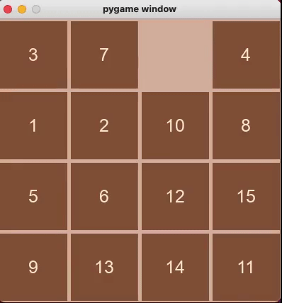

# Permutation-Puzzles

## About The Project
This project is for practicing common graph algorithms, such as BFS, DFS, A*, RBFS, etc, and using these algorithms to solve 15 puzzle.

## Build With

- Python 3.8

## Getting Start

```
pip install -r requirements.txt
```

## Usage
### Run
Run the program by specifing the maximum depth(degree) of the solution. The maximum depth should between 0 to 25.
```
# run with max_degree 20
python -m fifteen_puzzle.puzzle_solver --max_degree 20

# run with max_degree 20 in debug mode
python -m fifteen_puzzle.puzzle_solver --max_degree 20 --debug debug

# run with max_degree 20 and output trace
python -m fifteen_puzzle.puzzle_solver --max_degree 20 --debug info > output.txt
```



### Termination
Hit `ecs` to terminate `pygame`

## Reference
- [Permutation Puzzles - Math 304 - Simon Fraser University](http://www.sfu.ca/~jtmulhol/math302/lectures.html)
- [Artificial Intelligence: A Modern Approach 3rd Edition](https://www.amazon.com/Artificial-Intelligence-Modern-Approach-3rd/dp/0136042597)
